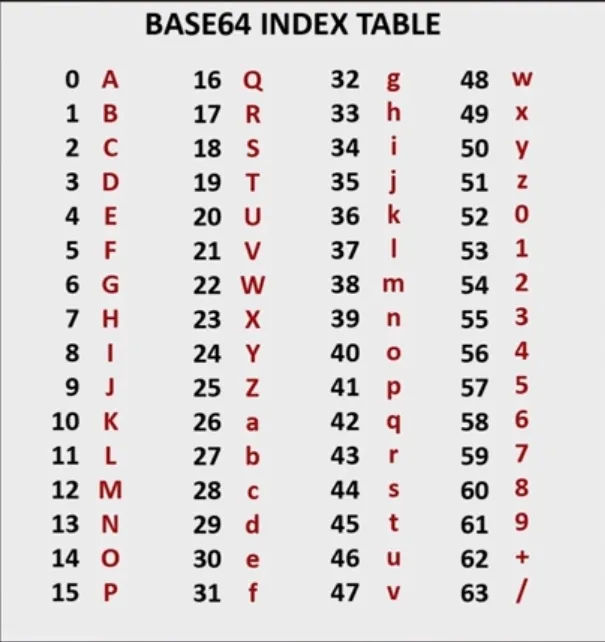

# Base64 인코딩이란?

- **인코딩**
    - 인코딩은 **데이터의 표준화, 처리 속도 향상, 저장 공간 절약, 보안** 등의 이유로 어떤 데이터를 다른 형식으로 변환하는 것이다. 

- **64진법**
    - ASCII 문자로 표시할 수 있는 가장 큰 진법이 64진법이다.

### Base64
- Base64는 binary data를 ASCII 문자로만 이루어진 TEXT로 변환하는 인코딩 방법이다.
- '='는 패딩을 의미한다.
    - 인코딩된 문자열이 '='로 끝난다면 Base64로 인코딩 되었음을 알 수 있다.

#### 왜 등장했을까?
이전 SMTP 프로토콜에서 7-bit의 제한된 메시지를 사용해서는 사진과 음성 등의 컨텐츠를 전송할 수 없었다. 이떄 8-bit의 ASCII를 사용하기 위해서 MIME과 같은 새로운 인터넷 표준이 등장했는데, 여기서 사용되는 인코딩 체계가 Base64인 것이다.

#### 왜 64일까?
ASCII 문자로 표현 가능한 가장 큰 진법이 64진법이다. 65는 6개의 비트로 표현 불가능하다.

#### 어떻게 작동할까?
8-bit로 표현된 binary data를 6-bit로 그룹화 한 뒤 각 청크를 Base64 문자 테이블에서 매핑한다.

>**Hey -> 01001000 01100101 01111001**
>
>H - to ord -> 72  - to bin -> 01001000
>e - to ord -> 101 - to bin -> 01100101
>y - to ord -> 121 - to bin -> 01111001
>
>**010010 000110 010101 111001 -> S G V 5**
>
>010010 - to dec -> 18 - to base64 -> S
>000110 - to dec -> 6  - to base64 -> G
>010101 - to dec -> 21 - to base64 -> V
>111001 - to dec -> 57 - to base64 -> 5
>
>
>
>#### 결과 값: SGV5Cg==
>
>**Cg==** 는 뭐야?
>- Base 64 인코딩 알고리즘을 특정 텍스트에 적용하면 “새 줄” (New line)도 고려한다.
>- New Line을 만들 때 \r(carriage return)이 포함되었기 때문에 Hey가 아닌 HeyLF인 것이다.
>   - LF - to dec -> 10 - to bin -> 00001010
>   - 000010 10(0000) - to base64 -> Cg==(0000으로 채웠던 패딩 ㄱ밧)

### 뭐이리 복잡해 그냥 이진수 쓰면 안돼?
결국 Base64는 binary data를 텍스트 형식으로 사용할 수 있다는 것이다.

HTTP, SMTP 등의 인터넷 프로토콜은 순수한 텍스트 기반이다. 이 프로토콜을 사용해 binary data를 직접 전송하려 하면, 데이터가 손상될 수 있다. **왜?** binary data 내에 개행 문자 등의 제어 문자열이 포함될 수 있기 때문이다.

그뿐 아니라 클라이언트와 서버 간 HTTP 프로토콜을 통해 리소스를 주고 받을 때 텍스트 형식이 가장 빠르고 효과적이다.

### 그럼 장점만 있나?
기본적으로 6-bit를 사용하기 때문에 기본 처리 단위인 8-bit와 맞지 않아. 기존 데이터에 비해 약 33% 더 큰 데이터를 생성한다. 그래서 대량의 데이터를 주고받는 시스템에서는 추가적인 데이터 전송 시간과 비용이 생길 수 있다.

그리고 기본적으로 클라이언트와 서버 양쪽에서 모두 인코딩된 데이터를 디코딩해야 하므로, 처리 시간이 증가하게 된다. 이때 CPU 자원이 제한적이라면 Base64 인코딩을 지양하는 것이 좋다.
